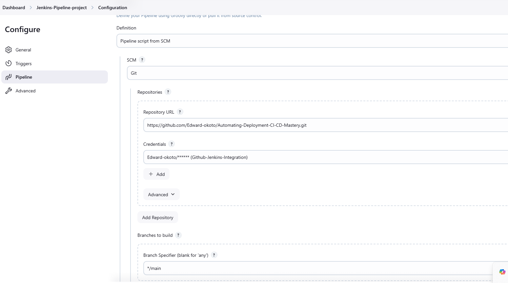

# Automating-Deployment-CI-CD-Mastery


### **1. Jenkins Server Setup**
**Objective**: Configure Jenkins server for CI/CD pipeline automation.

#### **Steps**:
 **Installation of Jenkins**:

   - Use the commands from this webpage to install [jenkins](https://phoenixnap.com/kb/install-jenkins-ubuntu) 

  - OR follow these installation steps below

  1. **Install Java** (Required for Jenkins):

      ```bash
      sudo apt update
      sudo apt install openjdk-11-jdk -y
      ```
   - **Explanation**:
     - Jenkins requires Java as its runtime environment. Installing OpenJDK ensures compatibility.
     - The `headless` JDK excludes graphical components, optimizing for server environments.
   - **Security Measure**:
     - Use official package repositories to ensure secure and verified Java installation.


     
     

  2. **Add Jenkins Repository and Key**:
      ```bash
      curl -fsSL https://pkg.jenkins.io/debian-stable/jenkins.io.key | sudo tee \
      /usr/share/keyrings/jenkins-keyring.asc > /dev/null
      echo deb [signed-by=/usr/share/keyrings/jenkins-keyring.asc] \
      https://pkg.jenkins.io/debian-stable binary/ | sudo tee \
      /etc/apt/sources.list.d/jenkins.list > /dev/null
      ```


  3. **Install Jenkins**:
      ```bash
      sudo apt update
      sudo apt install jenkins -y
      sudo systemctl start jenkins
      sudo systemctl enable jenkins
      ```
   - **Explanation**:
     - Adding the GPG key and repository ensures that Jenkins packages are verified and trusted.
     - Starting Jenkins makes the service available, while enabling it ensures it starts on boot.
   - **Security Measure**:
     - Use HTTPS URLs for repositories to prevent tampering during package retrieval.
     - Verify GPG keys to authenticate package integrity.

---

#### **Access Jenkins Web Interface**
1. Retrieve the default administrator password:
   ```bash
   sudo cat /var/lib/jenkins/secrets/initialAdminPassword
   ```
2. Open the Jenkins URL in a browser:
   ```
   http://<jenkins-server-ip>:8080
   ```
3. Paste the password into the unlock page and install suggested plugins.

---

#### **Set Up Plugins**

Install suggested pluggings


Then Navigate to **Jenkins Dashboard > Manage Jenkins > Manage Plugins** and install the following if not already installed.

- **Git Plugin**: Integrates Jenkins with GitHub for source code management.
- **Docker Pipeline Plugin**: Enables Docker commands within Jenkins pipelines.
- **Pipeline Maven Integration Plugin**: Automates Maven builds.
- **Blue Ocean Plugin**: Improves pipeline visualization.
- **Security Measure**:
 Install plugins only from the Jenkins official plugin repository to mitigate risks of malicious software.


3. **Configure Jenkins Security**:
   - Set up an admin user during the first-time setup.

     
     
   - Enable **CSRF Protection** under **Manage Jenkins > Configure Global Security**.
   - Install the **Role-Based Authorization Strategy** plugin to assign permissions to users.

---

### **2. Source Code Management Repository Integration**
**Objective**: Connect Jenkins to GitHub for source code management.

#### **Steps**:
1. **Integrate Jenkins with GitHub**:
   - Add GitHub credentials:
     - Navigate to **Manage Jenkins > Credentials**.
     - Add a new credential with your GitHub personal access token.
     - **Security Measure**:
      Use the minimum scope required for the token 


     

   - Configure the repository in Jenkins:
     - In the job configuration, specify the GitHub repository URL and associate the credentials.

     

2. **Set Up Webhooks**:
   - Go to your GitHub repository settings:
     - Navigate to **Settings > Webhooks > Add webhook**.
     - Enter the **Payload URL**: `http://<jenkins-server-ip>:8080/github-webhook/`.
     - Set **Content type** to `application/json`.
   - Enable the webhook to trigger builds automatically when code is pushed.
   - **Security Measure**:
     - Restrict webhook URLs to Jenkins-specific endpoints.
     - Use a firewall or IP filtering to prevent unauthorized webhook access.

     

---

### **3. Jenkins Freestyle Jobs for Build and Unit Tests**
**Objective**: Create Jenkins freestyle jobs to build and test the application.

#### **Steps**:
1. **Set Up a Freestyle Job**:
   - Create a new freestyle job:
     - Navigate to **Dashboard > New Item > Freestyle Project**.
     - Configure the job:
       Pull source code from GitHub using the repository URL.

     

     

   - Define build steps:
     - Add shell commands to build and run tests:
       ```bash
       mvn clean install

       mvn test
       ```
      


2. **Post-Build Actions**:
   - Configure actions like archiving artifacts or sending notifications.
    
     

     

---

### **4. Jenkins Pipeline for Web Application**
**Objective**: Develop a Jenkins pipeline script for automating the CI/CD process.

#### **Steps**:
1. **Create a Declarative Pipeline**:
   - Navigate to **Dashboard > New Item > Pipeline**.
   - Use the following declarative pipeline script:
  ```groovy
     pipeline {
         agent any

         environment {
             DOCKERHUB_USERNAME = credentials('docker-hub-username') // Replace with Docker Hub credential ID
             DOCKERHUB_PASSWORD = credentials('docker-hub-password')
             DOCKER_IMAGE = 'edwardokoto1/jenkins-project:latest'
         }

         tools {
             maven 'Maven 3' // Name of Maven installation in Jenkins Global Tool Configuration
         }

         stages {
             stage('Checkout Code') {
                 steps {
                     git branch: 'main', url: 'https://github.com/Edward-okoto/Automating-Deployment-CI-CD-Mastery.git'
                 }
             }

             stage('Build and Test') {
                 steps {
                     sh 'mvn clean install'
                 }
             }

             stage('Build Docker Image') {
                 steps {
                     sh "docker build -t $DOCKER_IMAGE ."
                 }
             }

             stage('Push Docker Image') {
                 steps {
                     script {
                         sh """
                         echo $DOCKERHUB_PASSWORD | docker login -u $DOCKERHUB_USERNAME --password-stdin
                         docker push $DOCKER_IMAGE
                         """
                     }
                 }
             }
         }

         post {
             always {
                 echo 'Pipeline execution completed!'
             }
         }
     }
  ```

This **declarative pipeline script** written in Groovy is used in Jenkins to automate various stages of a CI/CD process for a project. 

---

#### **Pipeline Structure**

The pipeline is defined using the `pipeline` block, which organizes the process into **stages**. Each stage performs a specific task in the workflow.

---

#### **1. `agent any`**
- **Purpose**: Specifies the execution environment for the pipeline.
- **Explanation**:
  - By using `agent any`, the pipeline will run on any available Jenkins agent. This could be a local machine or a remote node connected to Jenkins.

---

#### **2. `environment`**
- **Purpose**: Defines environment variables that will be used throughout the pipeline.
- **Explanation**:
  - **`DOCKERHUB_USERNAME`**: Stores the Docker Hub username securely. It references Jenkins credentials stored with the ID `docker-hub-username`.
  - **`DOCKERHUB_PASSWORD`**: Stores the Docker Hub password securely. It uses Jenkins credentials with the ID `docker-hub-password`.
  - **`DOCKER_IMAGE`**: Specifies the name and tag for the Docker image that will be built and pushed during the pipeline execution.

---

#### **3. `tools`**
- **Purpose**: Configures tools that the pipeline requires.
- **Explanation**:
  - **`maven 'Maven 3'`**: Specifies that Maven (version 3) will be used. The Maven installation must be defined in Jenkins Global Tool Configuration.

---

#### **4. `stages`**
This block defines sequential tasks to execute in the pipeline.

#### **Stage 1: Checkout Code**
```groovy
stage('Checkout Code') {
    steps {
        git branch: 'main', url: 'https://github.com/Edward-okoto/Automating-Deployment-CI-CD-Mastery.git'
    }
}
```
- **Purpose**: Pulls the latest code from the GitHub repository.
- **Explanation**:
  - **`branch: 'main'`**: Specifies the branch of the repository to clone.
  - **`url`**: The URL points to the repository where the source code is hosted.

---

#### **Stage 2: Build and Test**
```groovy
stage('Build and Test') {
    steps {
        sh 'mvn clean install'
    }
}
```
- **Purpose**: Builds the application and runs unit tests using Maven.
- **Explanation**:
  - **`mvn clean install`**:
    - `clean`: Deletes any previous build files to start fresh.
    - `install`: Builds the project, runs tests, and installs artifacts into the local Maven repository.

---

#### **Stage 3: Build Docker Image**
```groovy
stage('Build Docker Image') {
    steps {
        sh "docker build -t $DOCKER_IMAGE ."
    }
}
```
- **Purpose**: Builds a Docker image for the application.
- **Explanation**:
  - **`docker build -t $DOCKER_IMAGE .`**:
    - `-t`: Tags the Docker image with the specified name (`DOCKER_IMAGE` variable).
    - `.`: Uses the Dockerfile located in the root directory of the project to build the image.

---

#### **Stage 4: Push Docker Image**
```groovy
stage('Push Docker Image') {
    steps {
        script {
            sh """
            echo $DOCKERHUB_PASSWORD | docker login -u $DOCKERHUB_USERNAME --password-stdin
            docker push $DOCKER_IMAGE
            """
        }
    }
}
```
- **Purpose**: Pushes the built Docker image to Docker Hub.
- **Explanation**:
  - **Docker Login**:
    - Logs into Docker Hub using the username (`DOCKERHUB_USERNAME`) and password (`DOCKERHUB_PASSWORD`) stored as Jenkins credentials.
    - **`--password-stdin`**: Ensures secure login by avoiding exposing the password in plaintext.
  - **Docker Push**:
    - Pushes the Docker image specified by the `DOCKER_IMAGE` variable to Docker Hub.

---

#### **5. `post`**
The `post` block defines actions that will always run after pipeline execution, regardless of success or failure.

```groovy
post {
    always {
        echo 'Pipeline execution completed!'
    }
}
```
- **Purpose**: Ensures that a completion message is displayed after pipeline execution.
- **Explanation**:
  - **`always`**:
    - Runs regardless of the pipeline’s outcome (success or failure).

---

#### **Key Features of This Pipeline**
1. **Automation**: Fully automates the CI/CD process.
2. **Security**:
   - Uses Jenkins credentials for Docker Hub authentication instead of hardcoding sensitive information.
3. **Flexibility**:
   - The `DOCKER_IMAGE` environment variable allows easy customization of the image name and tag.
4. **Reusable**:
   - You can adapt the pipeline for other projects by simply updating repository URLs and variables.

---


### **5. Docker Image Creation and Registry Push**
**Objective**: Automate Docker image creation and push to Docker Hub.

**Add Docker Hub Credentials in Jenkins**

**Go to Jenkins Dashboard**:

- Navigate to your Jenkins instance in a browser (e.g., `http://<your-server-ip>:8080`).

**Access Jenkins Credentials**:

- From the Jenkins dashboard, click `Manage Jenkins`.

- Select `Manage Credentials`.

**Add New Credentials**:

- Choose a credentials domain (commonly Global).

- Click Add Credentials.

- Select Secret text as the type.

**Add the Docker Hub Username**:

`For docker-hub-username`:

- In the `Secret` field, enter your Docker Hub username.

- Set an `ID` for this credential, e.g., docker-hub-username.

- Add a description (optional) to identify its purpose.

- Save the credential.


**Add the Docker Hub Password/Token**:

`Repeat the process for docker-hub-password`:

- In the Secret field, enter your Docker Hub password or access token.

- Set an ID for this credential, e.g., docker-hub-password.

- Add a description (optional).

- Save the credential.


1.**Create Dockerfile**:
   - Add a `Dockerfile` to your project repository:
     ```dockerfile
     FROM openjdk:11-jdk-slim
     WORKDIR /app
     COPY target/ecommerce-app.jar /app/ecommerce-app.jar
     ENTRYPOINT ["java", "-jar", "/app/ecommerce-app.jar"]
     ```

2.**Configure Docker in Jenkins**:
   - Ensure Docker is installed and Jenkins has permission to execute Docker commands:
     ```bash
     sudo usermod -aG docker jenkins
     sudo systemctl restart jenkins
     ```

3.**Push the Jenkinsfile and Other Project Files to GitHub**:

Include the Dockerfile, pom.xml, source code, and Jenkinsfile in your repository.

- Create a New Pipeline Job in Jenkins:

- Navigate to New Item > Pipeline.

 

- Name the pipeline (e.g., Maven Docker Project).

- Select Pipeline script from SCM.

- Choose Git as the SCM and provide the repository URL.

- Choose `GitHub hook trigger for GITScm polling`


 


Result :Complete CI/CD pipeline


Image was successfully pushed to DOCKERHUB.


